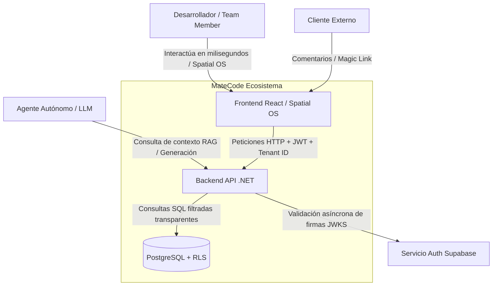

# Arquitectura Arc42 - Sección 1: Contexto y Alcance

Este documento describe el alcance funcional de **MateCode** y sus fronteras de interacción con usuarios finales, clientes externos y sistemas de asistencia de Inteligencia Artificial.

---

## 1. Contexto de Negocio

El siguiente diagrama conceptual y lógico representa los límites de interacción de MateCode:

### Roles y Actores
1.  **Desarrollador (Usuario Autenticado):** Accede al espacio de trabajo (Workspace) a través del portal de MateCode. Administra clientes, define epicas/historias, configura el stack de diseño y trabaja en el Kanban de la Fase 3.
2.  **Cliente (Usuario Magic Link):** Accede de forma directa y simplificada sin registrar contraseñas. Brinda feedback asíncrono y visualiza el avance del proyecto.
3.  **Asistente IA (Consumidor RAG):** Consume el índice `llms.txt` y los manifiestos de restricciones en Cursor para generar código limpio, validando en todo momento que se respeten los estándares arquitectónicos del dominio.

---

## 2. Contexto Técnico e Interfaces del Sistema

*   **API del Servidor (.NET 8/9):** Expone endpoints RESTful estructurados bajo Clean Architecture. Se encarga de procesar las transacciones y compilar prompts inyectando datos mediante Microsoft Semantic Kernel.
*   **Cliente Frontend (Vite/React 18):** Implementa el sistema espacial en 2D (coordenadas poligonales) y 3D (React Three Fiber), comunicándose de forma síncrona con el backend mediante peticiones HTTP autenticadas y sockets real-time (SignalR) para la sincronización de presencia de avatares.
*   **Supabase Auth & Database:** Actúa como el proveedor de identidad, suministrando JWTs y llaves públicas de desencriptado (ECC P-256) y exponiendo la persistencia Postgres con políticas de seguridad Multi-Tenant a nivel de fila (RLS).
