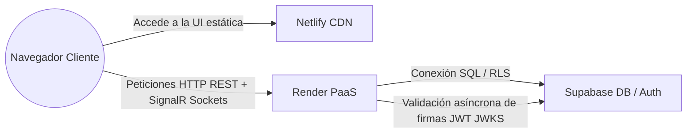

# Arquitectura Arc42 - Sección 3: Estrategia de Despliegue e Infraestructura

Este documento describe la topología de red, servidores y base de datos para los entornos de desarrollo local y los despliegues de producción de **MateCode**.

---

## 1. Entorno de Producción (Cloud Deployment)

El sistema productivo se encuentra distribuido de forma optimizada en tres plataformas SaaS/PaaS líderes, asegurando alta disponibilidad y bajos costos de mantenimiento:

1.  **Capa de Presentación (Netlify):**
    *   Aloja la compilación estática del frontend (HTML, JS, CSS generado por Vite).
    *   Configurado con redirecciones limpias mediante `netlify.toml` para soportar el enrutamiento SPA de React.
2.  **Capa de Aplicación y API (Render):**
    *   Ejecuta el servidor web de .NET API alojado en contenedores Linux.
    *   Administra las conexiones HTTP asíncronas, los hubs de sockets real-time (SignalR) para presencia, y orquesta los llamados al motor de prompts (Semantic Kernel).
3.  **Capa de Persistencia y Seguridad (Supabase Cloud):**
    *   Base de datos PostgreSQL 15 en la nube con extensiones UUID, JSONB y GIN habilitadas.
    *   Proveedor de identidad OAuth/JWT ECC P-256 para validaciones de firma asimétrica descentralizadas en el backend.

---

## 2. Entorno de Desarrollo Local (Local Dev-First)

Para asegurar la ejecución local rápida y reproducible:
*   **Base de datos local:** PostgreSQL levantado localmente o mediante la inicialización rápida de tablas en Docker usando el script `backend/db/init.sql`.
*   **Emulación de Autenticación:** Se utiliza el CLI local de Supabase (`supabase start`) o llaves de desarrollo estáticas configuradas en `appsettings.Development.json` para emular firmas sin requerir conexión a internet.
*   **API y Cliente:** Ejecutados de forma independiente usando `dotnet run` (puerto 5241) y `npm run dev` (puerto 5173).
