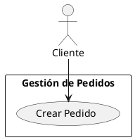

# MÓDULO: fase_2_diseno (Arquitectura y Diagramación Visual)

## 1. Objetivo del Módulo
Definir el "Cómo" del proyecto. Este módulo tiene dos propósitos centrales:
1. **Contrato Técnico:** Seleccionar el Stack Tecnológico, Arquitectura (ej. Clean Architecture) y Patrones que guiarán a la IA en la Fase 3.
2. **Modelado Visual Bidireccional:** Proveer un entorno donde el usuario pueda estructurar el sistema gráficamente (ERD, UML, Sitemaps) interactuando tanto con código estandarizado (DBML, PlantUML) como con un lienzo visual interactivo (Drag & Drop).

## 2. El Motor de Diagramas (Sincronización Bidireccional)
El sistema rechaza los diagramas estáticos que quedan desactualizados. 
* **Editor Híbrido (Split View):** La pantalla se divide en dos. [cite_start]De un lado, un editor de código; del otro, el lienzo visual (`xyflow` / React Flow)[cite: 42].
* [cite_start]**Reactividad:** Si el usuario pega un código DBML en el editor, el lienzo dibuja las tablas automáticamente[cite: 38]. Si el usuario arrastra una línea visualmente entre dos tablas en el lienzo para crear una relación, el código DBML en el editor de texto se actualiza en tiempo real.

## 3. Formatos Soportados y Plantillas Estrictas
La IA encargada de compilar este módulo DEBE utilizar analizadores (parsers) para convertir los siguientes formatos a nodos de React Flow y viceversa:

### A. Diagramas ERD (Base de Datos)
* **Formato:** DBML (Database Markup Language).
* **Plantilla Base:**
```dbml
Table users {
  id int [pk, increment]
  name varchar
  email varchar [unique]
  created_at timestamp
}
Table orders {
  id int [pk, increment]
  user_id int [ref: > users.id]
}
```

### B. Diagramas UML (Casos de Uso / Secuencia)
* **Formato:** PlantUML.
* **Plantilla Base:**


### C. Sitemaps (Estructura de Navegación)
* **Formato:** JSON Jerárquico.
* **Plantilla Base:**
```json
{
  "sitemap": {
    "home": {
      "sections": [
        { "name": "Productos", "children": [ {"name": "Listado"} ] }
      ]
    }
  }
}
```

### D. Matriz de Roles (Permisos)
* **Formato:** JSON/YAML Estructurado.
* **Plantilla Base:**
```json
{
  "roles": [
    { "name": "Usuario Anónimo", "permissions": ["Registrarse"] },
    { "name": "Proveedor", "inherits": "Usuario Base", "permissions": ["Publicar Catálogo"] }
  ]
}
```

## 4. Retroalimentación (El Beneficio Activo)

### Inyección de Prompts
Todo lo definido acá (el Stack guardado y el texto DBML de la base de datos) viaja automáticamente al Motor de Prompts de la Fase 3.

### Micro-Copy Educativo (Tono Mentor Argentino)
* **Alertas:** "Armá tu base de datos acá en formato DBML o arrastrando las tablas. Si dejás esto bien armadito, cuando te toque programar el Backend, la IA ya va a saber exactamente cómo se llaman todas tus columnas y claves foráneas. ¡Un lujo!"
* **Botones de Guardado:** En vez de "Save", usar "Guardar Stack en la Bóveda" (para que sirva en futuros proyectos).

## 5. Reglas Estrictas para la IA (Generación de Código Frontend)

### Librerías Visuales
Usar estrictamente React Flow (xyflow) para el renderizado interactivo y motores como Dagre o ElkJS asíncronos para calcular la auto-disposición (auto-layout) de los nodos generados por código. **PROHIBIDO** usar motores basados en canvas que no permitan integrar inputs HTML nativos.

### Límite de Componentes
La vista híbrida debe desacoplarse. Archivos requeridos:
* `<DiagramWorkspace />` (Layout)
* `<CodeEditorPane />` (Manejo de texto monospaced)
* `<VisualCanvas />` (Instancia de React Flow)
* `<ParserService.ts>` (Lógica de conversión DBML/PlantUML a Nodos/Aristas)

### Almacenamiento
Guardar el texto puro (DBML, PlantUML) en la base de datos PostgreSQL como JSONB dentro del `projects.project_context`. React Flow reconstruye la vista visual a partir de este código cada vez que se recarga la página.

Con este módulo, si armás un proyecto como Animal Connect, podés pegar rápidamente un diagrama de roles en YAML o armar la base de datos de usuarios en DBML, y el sistema ya lo deja vivo e interactivo.

